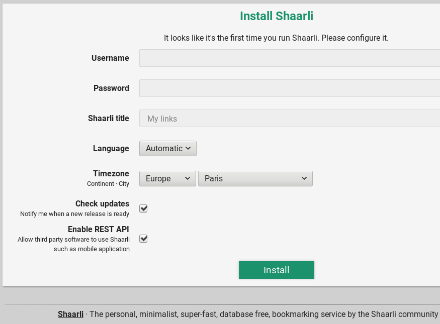

To install Shaarli, simply place the files in a directory under your webserver's
Document Root (or directly at the document root).

Also, please make sure your server is properly [configured](Server-configuration.md).

Multiple releases branches are available:

- latest (last release)
- stable (previous major release)
- master (development)

Using one of the following methods:

- by downloading full release archives including all dependencies
- by downloading Github archives
- by cloning the Git repository
- using Docker: [see the documentation](docker/shaarli-images.md)

--------------------------------------------------------------------------------

## Latest release (recommended)

### Download as an archive

In most cases, you should download the latest Shaarli release from the [releases](https://github.com/shaarli/Shaarli/releases) page. Download our **shaarli-full** archive to include dependencies.

The current latest released version is `v0.10.4`

```bash
$ wget https://github.com/shaarli/Shaarli/releases/download/v0.10.4/shaarli-v0.10.4-full.zip
$ unzip shaarli-v0.10.4-full.zip
$ mv Shaarli /path/to/shaarli/
```

### Using git

Cloning using `git` or downloading Github branches as zip files requires additional steps:

 * Install [Composer](Unit-tests.md#install_composer) to manage third-party [PHP dependencies](3rd-party-libraries.md#composer).
 * Install [yarn](https://yarnpkg.com/lang/en/docs/install/) to build the frontend dependencies.
 * Install [python3-virtualenv](https://pypi.python.org/pypi/virtualenv) to build the local HTML documentation.

```
$ mkdir -p /path/to/shaarli && cd /path/to/shaarli/
$ git clone -b latest https://github.com/shaarli/Shaarli.git .
$ composer install --no-dev --prefer-dist
$ make build_frontend
$ make translate
$ make htmldoc
```

--------------------------------------------------------------------------------

## Stable version

The stable version has been experienced by Shaarli users, and will receive security updates.


### Download as an archive

As a .zip archive:

```bash
$ wget https://github.com/shaarli/Shaarli/archive/stable.zip
$ unzip stable.zip
$ mv Shaarli-stable /path/to/shaarli/
```

As a .tar.gz archive :

```bash
$ wget https://github.com/shaarli/Shaarli/archive/stable.tar.gz
$ tar xvf stable.tar.gz
$ mv Shaarli-stable /path/to/shaarli/
```

### Using git

Install [Composer](Unit-tests.md#install_composer) to manage Shaarli dependencies.

```bash
$ git clone https://github.com/shaarli/Shaarli.git -b stable /path/to/shaarli/
# install/update third-party dependencies
$ cd /path/to/shaarli/
$ composer install --no-dev --prefer-dist
```


--------------------------------------------------------------------------------

## Development version (mainline)

_Use at your own risk!_

Install [Composer](Unit-tests.md#install_composer) to manage Shaarli PHP dependencies,
and [yarn](https://yarnpkg.com/lang/en/docs/install/)
for front-end dependencies.

To get the latest changes from the `master` branch:

```bash
# clone the repository
$ git clone https://github.com/shaarli/Shaarli.git -b master /path/to/shaarli/
# install/update third-party dependencies
$ cd /path/to/shaarli
$ composer install --no-dev --prefer-dist
$ make build_frontend
$ make translate
$ make htmldoc
```

-------------------------------------------------------------------------------

## Finish Installation

Once Shaarli is downloaded and files have been placed at the correct location, open it this location your favorite browser.



Setup your Shaarli installation, and it's ready to use!

## Updating Shaarli

See [Upgrade and Migration](Upgrade-and-migration)
