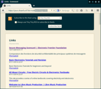
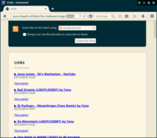

### Feeds options

Feeds are available in ATOM with `?do=atom` and RSS with `do=RSS`.

Options:

- You can use `permalinks` in the feed URL to get permalink to Shaares instead of direct link to shaared URL.
    - E.G. `https://my.shaarli.domain/?do=atom&permalinks`.
- You can use `nb` parameter in the feed URL to specify the number of Shaares you want in a feed (default if not specified: `50`). The keyword `all` is available if you want everything.
    - `https://my.shaarli.domain/?do=atom&permalinks&nb=42`
    - `https://my.shaarli.domain/?do=atom&permalinks&nb=all`

### RSS Feeds or Picture Wall for a specific search/tag

It is possible to filter RSS/ATOM feeds and Picture Wall on a Shaarli to **only display results of a specific search, or for a specific tag**.

For example, if you want to subscribe only to links tagged `photography`:

- Go to the desired Shaarli instance.
- Search for the `photography` tag in the _Filter by tag_ box. Links tagged `photography` are displayed.
- Click on the `RSS Feed` button.
- You are presented with an RSS feed showing only these links. Subscribe to it to receive only updates with this tag.
- The same method **also works for a full-text search** (_Search_ box) **and for the Picture Wall** (want to only see pictures about `nature`?)
- You can also build the URLs manually: 
    - `https://my.shaarli.domain/?do=rss&searchtags=nature`
    - `https://my.shaarli.domain/links/?do=picwall&searchterm=poney`

 
