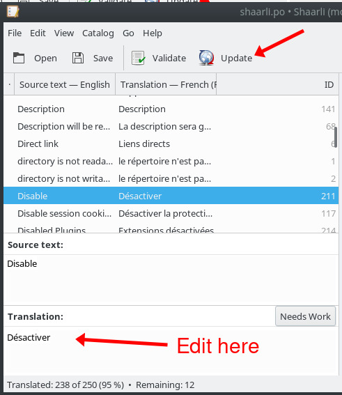

# Development

Please read [Contributing to Shaarli](https://github.com/shaarli/Shaarli/blob/master/CONTRIBUTING.md)


## Third-party libraries

CSS:

- Yahoo UI [CSS Reset](https://clarle.github.io/yui3/yui/docs/cssreset/) - standardize cross-browser rendering

Javascript:

- [Awesomeplete](https://projects.verou.me/awesomplete/) ([GitHub](https://github.com/LeaVerou/awesomplete)) - autocompletion in input forms
- [bLazy](https://dinbror.dk/blazy/) ([GitHub](https://github.com/dinbror/blazy)) - lazy loading for thumbnails
- [qr.js](https://github.com/neocotic/qrious) - QR code generation

PHP (managed through [`composer.json`](https://github.com/shaarli/Shaarli/blob/master/composer.json)):

- [RainTPL](https://github.com/feulf/raintpl) - HTML templating for PHP
- [`shaarli/netscape-bookmark-parser`](https://packagist.org/packages/shaarli/netscape-bookmark-parser) - Import bookmarks from Netscape files
- [`erusev/parsedown`](https://packagist.org/packages/erusev/parsedown) - Parse MarkDown syntax for the MarkDown plugin
- [`slim/slim`](https://packagist.org/packages/slim/slim) - Handle routes and middleware for the REST API
- [`ArthurHoaro/web-thumbnailer`](https://github.com/ArthurHoaro/web-thumbnailer) - PHP library which will retrieve a thumbnail for any given URL
- [`pubsubhubbub/publisher`](https://github.com/pubsubhubbub/php-publisher) - A PubSubHubbub publisher module for PHP.
- [`gettext/gettext`](https://github.com/php-gettext/Gettext) - PHP library to collect and manipulate gettext (.po, .mo, .php, .json, etc)


## Security

- The password is salted, hashed and stored in the data subdirectory, in a PHP file, and protected by htaccess. Even if the webserver does not support htaccess, the hash is not readable by URL. Even if the .php file is stolen, the password cannot deduced from the hash. The salt prevents rainbow-tables attacks.
- Directories are protected using `.htaccess` files
- Forms are protected against [XSRF](https://en.wikipedia.org/wiki/Cross-site_request_forgery):
    - Forms which act on data (save,delete…) contain a token generated by the server.
    - Any posted form which does not contain a valid token is rejected.
    - Any token can only be used once.
    - Tokens are attached to the session and cannot be reused in another session.
- Sessions automatically expire after 60 minutes.
- Sessions are protected against hijacking: the session ID cannot be used from a different IP address.
- Links are stored as an associative array which is serialized, compressed (with deflate), base64-encoded and saved as a comment in a `.php` file - even if the server does not support `.htaccess` files, the data file will still not be readable by URL.
- Bruteforce protection: Successful and failed login attempts are logged - IP bans are enforced after a configurable amount of failures. Logs can also be used consumed by [fail2ban](../Server-configuration.md#fail2ban)
- A pop-up notification is shown when a new release is available.

## Link structure

Every link available through the `LinkDB` object is represented as an array
containing the following fields:

  * `id` (integer): Unique identifier.
  * `title` (string): Title of the link.
  * `url` (string): URL of the link. Used for displayable links (without redirector, url encoding, etc.).
           Can be absolute or relative for Notes.
  * `real_url` (string): Real destination URL, can be redirected, encoded, etc.
  * `shorturl` (string): Permalink small hash.
  * `description` (string): Link text description.
  * `private` (boolean): whether the link is private or not.
  * `tags` (string): all link tags separated by a single space
  * `thumbnail` (string|boolean): relative path of the thumbnail cache file, or false if there isn't any.
  * `created` (DateTime): link creation date time.
  * `updated` (DateTime): last modification date time.

Small hashes are used to make a link to an entry in Shaarli. They are unique: the date of the item (eg. `20110923_150523`) is hashed with CRC32, then converted to base64 and some characters are replaced. They are always 6 characters longs and use only `A-Z a-z 0-9 - _` and `@`.


## Directory structure

Here is the directory structure of Shaarli and the purpose of the different files:

```bash
	index.php        # Main program
	application/     # Shaarli classes
		├── LinkDB.php

        ...

		└── Utils.php
	tests/           # Shaarli unitary & functional tests
		├── LinkDBTest.php

        ...

		├── utils    # utilities to ease testing
		│   └── ReferenceLinkDB.php
		└── UtilsTest.php
	assets/
	    ├── common/                # Assets shared by multiple themes
	        ├── ...
        ├── default/               # Assets for the default template, before compilation
            ├── fonts/                  # Font files
            ├── img/                    # Images used by the default theme
            ├── js/                     # JavaScript files in ES6 syntax
            ├── scss/                   # SASS files
        └── vintage/               # Assets for the vintage template, before compilation
            └── ...
    COPYING          # Shaarli license
    inc/             # static assets and 3rd party libraries
        └── rain.tpl.class.php     # RainTPL templating library
    images/          # Images and icons used in Shaarli
    data/            # data storage: bookmark database, configuration, logs, banlist...
        ├── config.json.php        # Shaarli configuration (login, password, timezone, title...)
        ├── datastore.php          # Your link database (compressed).
        ├── ipban.php              # IP address ban system data
        ├── lastupdatecheck.txt    # Update check timestamp file
        └── log.txt                # login/IPban log.
    tpl/             # RainTPL templates for Shaarli. They are used to build the pages.
        ├── default/               # Default Shaarli theme
            ├── fonts/                  # Font files
            ├── img/                    # Images
            ├── js/                     # JavaScript files compiled by Babel and compatible with all browsers
            ├── css/                    # CSS files compiled with SASS
        └── vintage/               # Legacy Shaarli theme
            └── ...
    cache/           # thumbnails cache
                     # This directory is automatically created. You can erase it anytime you want.
    tmp/             # Temporary directory for compiled RainTPL templates.
                     # This directory is automatically created. You can erase it anytime you want.
    vendor/          # Third-party dependencies. This directory is created by Composer
```

Shaarli needs read access to:

- the root index.php file
- the `application/`, `plugins/` and `inc/` directories (recursively)

Shaarli needs read/write access to the `cache/`, `data/`, `pagecache/`, and `tmp/` directories


## Automation

A [`Makefile`](https://github.com/shaarli/Shaarli/blob/master/Makefile) is available to perform project-related operations:

- [Static analysis](#Static-analysis) - check that the code is compliant to PHP conventions
- [Unit tests](#Unit-tests) - ensure there are no regressions introduced by new commits
- Javascript linting - Shaarli uses [Airbnb JavaScript Style Guide](https://github.com/airbnb/javascript). Run `make eslint` to check JS style.
- Documentation - generate a local HTML copy of the markdown documentation


## Continuous Integration

[Github Actions](https://github.com/shaarli/Shaarli/actions) is a Continuous Integration build server, that runs a build:

- each time a commit is pushed to any branch
- each time a Pull Request is submitted or updated

After all jobs have finished, Github Actions returns the results to GitHub:

- a status icon represents the result for the `master` branch: [](https://github.com/shaarli/Shaarli/actions)
- Pull Requests are updated with the Github Actions build result.

Github Actions is also used to build and push [Docker](../Docker.md) images to <https://github.com/shaarli/Shaarli/pkgs/container/shaarli> for the `master` branch and on every git `tag`/[release](https://github.com/shaarli/Shaarli/releases).

See [`.github/workflows/`](https://github.com/shaarli/Shaarli/tree/master/.github/workflows).


## Documentation

[Sphinx](https://www.sphinx-doc.org/en/master/) is used to convert markdown documentation to HTML pages. The [public documentation](https://shaarli.readthedocs.io/en/master/) website is rendered and hosted by [readthedocs.org](https://readthedocs.org/). A copy of the documentation is also included in prebuilt [release archives](https://github.com/shaarli/Shaarli/releases) (`doc/html/` path in your Shaarli installation). To generate the HTML documentation locally, run `make htmldoc`.


## Static analysis

Patches should try to stick to the [PHP Standard Recommendations](https://www.php-fig.org/psr/) (PSR), and must follow:

- [PSR-1](https://www.php-fig.org/psr/psr-1/) - Basic Coding Standard
- [PSR-2](https://www.php-fig.org/psr/psr-2/) - Coding Style Guide
- [PSR-12](https://www.php-fig.org/psr/psr-12/) - Extended Coding Style Guide

These are enforced on pull requests using our Continuous Integration tools with [PHP Code Sniffer](https://github.com/squizlabs/PHP_CodeSniffer).

Static analysis tools are installed with Composer dependencies, and used through Shaarli's [Makefile](https://github.com/shaarli/Shaarli/blob/master/Makefile) with `make code_sniffer`.

For an overview of the available features, see:

- [Code quality: Makefile to run static code checkers](https://github.com/shaarli/Shaarli/pull/124) (#124)
- [Apply PHP Code Sniffer to Shaarli code base](https://github.com/shaarli/Shaarli/pull/1635) (#1635)

## Unit tests

Shaarli uses the [PHPUnit](https://phpunit.de/) test framework; it can be installed with [Composer](../Installation.md#from-sources), which is a dependency management tool.

### Install composer

You can either use:

- a system-wide version, e.g. installed through your distro's package manager
- a local version, downloadable [here](https://getcomposer.org/download/).

```bash
# for Debian-based distros
sudo apt install composer
```

### Install Shaarli dev dependencies

After installing [required PHP extensions](../Server-configuration.md#php), install development dependencies:

```bash
$ cd /path/to/shaarli
$ make composer_dependencies_dev
```

### Install and enable Xdebug to generate PHPUnit coverage reports

[Xdebug](https://xdebug.org/docs/install) is a PHP extension which provides debugging and profiling capabilities. Install Xdebug:

```bash
# for Debian-based distros:
sudo apt install php-xdebug

# for ArchLinux:
pacman -S xdebug

# then add the following line to /etc/php/php.ini
zend_extension=xdebug.so
```

### Run unit tests

Ensure tests pass successfully:

```bash
make test
# ...
# OK (36 tests, 65 assertions)
```

In case of failure the test suite will point you to actual errors and output a summary:

```bash
make test
# ...
# FAILURES!
# Tests: 36, Assertions: 63, Errors: 1, Failures: 2.
```

By default, PHPUnit will run all suitable tests found under the `tests` directory. Each test has 3 possible outcomes:

- `.` - success
- `F` - failure: the test was run but its results are invalid
    - the code does not behave as expected
    - dependencies to external elements: globals, session, cache...
- `E` - error: something went wrong and the tested code has crashed
    - typos in the code, or in the test code
    - dependencies to missing external elements

If Xdebug has been installed and activated, two coverage reports will be generated:

- a summary in the console
- a detailed HTML report with metrics for tested code
    - to open it in a web browser: `firefox coverage/index.html &`


### Executing specific tests

Add a [`@group`](https://phpunit.de/manual/6.5/en/appendixes.annotations.html) annotation in a test class or method comment:

```php
/**
 * Netscape bookmark import
 * @group WIP
 */
class BookmarkImportTest extends PHPUnit_Framework_TestCase
{
   [...]
}
```

To run all tests annotated with `@group WIP`:
```bash
$ vendor/bin/phpunit --group WIP tests/
```

### Running tests inside Docker containers

Unit tests can be run inside [Docker](../Docker.md) containers.

Test Dockerfiles are located under `tests/docker/<distribution>/Dockerfile`, and can be used to build Docker images to run Shaarli test suites under commonLinux environments. Dockerfiles are provided for the following environments:

- [`alpine318`](https://github.com/shaarli/Shaarli/blob/master/tests/docker/alpine318/Dockerfile) - [Alpine Linux 3.18](https://www.alpinelinux.org/downloads/)
- [`debian8`](https://github.com/shaarli/Shaarli/blob/master/tests/docker/debian8/Dockerfile) - [Debian 8 Jessie](https://wiki.debian.org/DebianJessie) (oldoldstable)
- [`debian9`](https://github.com/shaarli/Shaarli/blob/master/tests/docker/debian9/Dockerfile) - [Debian 9 Stretch](https://wiki.debian.org/DebianStretch) (oldstable)
- [`ubuntu16`](https://github.com/shaarli/Shaarli/blob/master/tests/docker/ubuntu16/Dockerfile) - [Ubuntu 16.04 Xenial Xerus](https://releases.ubuntu.com/16.04/) (old LTS)

Each image provides:
- a base Linux OS
- Shaarli PHP dependencies (OS packages)
- test PHP dependencies (OS packages)
- Composer
- Tests that run inside the container using a standard Linux user account (running tests as `root` would bypass permission checks and may hide issues)

Build a test image:

```bash
# build the Debian 9 Docker image
cd /path/to/shaarli/tests/docker/debian9
docker build -t shaarli-test:debian9 .
```

Run unit tests in a container:

```bash
cd /path/to/shaarli
# install/update 3rd-party test dependencies
composer install --prefer-dist
# run tests using the freshly built image
docker run -v $PWD:/shaarli shaarli-test:debian9 docker_test
# run the full test campaign
docker run -v $PWD:/shaarli shaarli-test:debian9 docker_all_tests
```

## GnuPG Signature

[Gnu Privacy Guard](https://gnupg.org/) (GnuPG) is an Open Source implementation of the [Pretty Good Privacy](https://en.wikipedia.org/wiki/Pretty_Good_Privacy#OpenPGP) (OpenPGP) specification. Its main purposes are digital authentication, signature and encryption. It is often used by the [FLOSS](https://en.wikipedia.org/wiki/Free_and_open-source_software) community to verify:

- Linux package signatures: Debian [SecureApt](https://wiki.debian.org/SecureApt), ArchLinux [Master Keys](https://archlinux.org/master-keys/)
- [Version control](https://en.wikipedia.org/wiki/Revision_control) releases & maintainer identity

> You MUST understand that presence of data in the keyserver (pools) in no way connotes trust. Anyone can generate a key, with any name or email address, and upload it. All security and trust comes from evaluating security at the “object level”, via PGP [Web of trust](https://en.wikipedia.org/wiki/Web_of_trust) signatures. This keyserver makes it possible to retrieve keys, looking them up via various indices, but the collection of keys in this public pool is KNOWN to contain malicious and fraudulent keys. It is the common expectation of server operators that users understand this and use software which, like all known common OpenPGP implementations, evaluates trust accordingly. This expectation is so common that it is not normally explicitly stated.

-- Phil Pennock (author of the SKS key server)

Trust can be gained by having your key signed by other people (and signing their key back, too :) ), for instance during [key signing parties](https://en.wikipedia.org/wiki/Key_signing_party): [Keysigning party HOWTO](https://www.cryptnet.net/fdp/crypto/keysigning_party/en/keysigning_party.html),


### Generate a GPG key

- [Generating a GPG key for Git tagging](https://stackoverflow.com/questions/12061645/generating-a-gpg-key-for-git-tagging/16725717#16725717) (StackOverflow)
- [Generating a GPG key](https://docs.github.com/en/authentication/managing-commit-signature-verification) (GitHub)

```bash
$ gpg --gen-key

gpg (GnuPG) 2.1.6; Copyright (C) 2015 Free Software Foundation, Inc.
This is free software: you are free to change and redistribute it.
There is NO WARRANTY, to the extent permitted by law.

Note: Use "gpg2 --full-gen-key" for a full featured key generation dialog.

GnuPG needs to construct a user ID to identify your key.

Real name: Marvin the Paranoid Android
Email address: marvin@h2g2.net
You selected this USER-ID:
    "Marvin the Paranoid Android <marvin@h2g2.net>"

Change (N)ame, (E)mail, or (O)kay/(Q)uit? o
We need to generate a lot of random bytes. It is a good idea to perform
some other action (type on the keyboard, move the mouse, utilize the
disks) during the prime generation; this gives the random number
generator a better chance to gain enough entropy.
```

At this point, you will:
- be prompted for a secure password to protect your key (the input method will depend on your Desktop Environment and configuration)
- be asked to use your machine's input devices (mouse, keyboard, etc.) to generate random entropy; this step _may take some time_ 

GnuPG will the confirm key creation:

```bash
gpg: key A9D53A3E marked as ultimately trusted
public and secret key created and signed.

gpg: checking the trustdb
gpg: 3 marginal(s) needed, 1 complete(s) needed, PGP trust model
gpg: depth: 0  valid:   2  signed:   0  trust: 0-, 0q, 0n, 0m, 0f, 2u
pub   rsa2048/A9D53A3E 2015-07-31
      Key fingerprint = AF2A 5381 E54B 2FD2 14C4  A9A3 0E35 ACA4 A9D5 3A3E
uid       [ultimate] Marvin the Paranoid Android <marvin@h2g2.net>
sub   rsa2048/8C0EACF1 2015-07-31
```

Optionally, you can submit your public key to a PGP server:

``` bash
$ gpg --keyserver pgp.mit.edu --send-keys A9D53A3E
gpg: sending key A9D53A3E to hkp server pgp.mit.edu
```

## Release Shaarli

This guide assumes that you have:

- a GPG key matching your GitHub authentication credentials/email (the email address identified by the GPG key is the same as the one in your `~/.gitconfig`)
- a GitHub fork of Shaarli
- a local clone of your Shaarli fork, with the following remotes:
    - `origin` pointing to your GitHub fork
    - `upstream` pointing to the main Shaarli repository
- maintainer permissions on the main Shaarli repository, to:
    - push the signed tag
    - create a new release
- [Composer](https://getcomposer.org/) needs to be installed
- The [venv](https://docs.python.org/3/library/venv.html) Python 3 module needs to be installed for HTML documentation generation.
- Make sure you have GNU `tar` installed (not BSD `tar`). On macOS, you can install it with `brew install gnu-tar`.

### Release notes and `CHANGELOG.md`

GitHub allows drafting the release notes for the upcoming release, from the [Releases](https://github.com/shaarli/Shaarli/releases) page. This way, the release note can be drafted while contributions are merged to `master`. See https://keepachangelog.com/en/0.3.0/ for changelog formatting.

`CHANGELOG.md` should contain the same information as the release note draft for the upcoming version. Update it to:

- add new entries (additions, fixes, etc.)
- mark the current version as released by setting its date and link
- add a new section for the future unreleased version

```bash
## [v0.x.y](https://github.com/shaarli/Shaarli/releases/tag/v0.x.y) - UNRELEASES

### Added

### Changed

### Fixed

### Removed

### Deprecated

### Security

```

### Update the list of Git contributors

```bash
$ make generate_authors
$ git commit -s -m "Update AUTHORS"
```

### Create and merge a Pull Request

Create a Pull Request to marge changes from your remote, into `master` in the community Shaarli repository, and have it merged.


### Create the release branch and update shaarli_version.php

```bash
# fetch latest changes from master to your local copy
git checkout master
git pull upstream master

# If releasing a new minor version, create a release branch
$ git checkout -b v0.x
# Otherwise just use the existing one
$ git checkout v0.x

# Get the latest changes
$ git merge master

# Check that everything went fine:
$ make test

# Bump shaarli_version.php from dev to 0.x.0, **without the v**
$ vim shaarli_version.php doc/conf.py README.md
$ git add shaarli_version doc/conf.py README.md
$ git commit -s -m "Bump Shaarli version to v0.x.0"
$ git push upstream v0.x
```

### Create and push a signed tag

Git [tags](https://git-scm.com/book/en/v2/Distributed-Git-Maintaining-a-Project) are used to identify specific revisions with a unique version number that follows [semantic versioning](https://semver.org/)

```bash
# update your local copy
git checkout v0.5
git pull upstream v0.5

# create a signed tag
git tag -s -m "Release v0.5.0" v0.5.0

# push the tag to upstream
git push --tags upstream
```

Here is how to verify a signed tag. [`v0.5.0`](https://github.com/shaarli/Shaarli/releases/tag/v0.5.0) is the first GPG-signed tag pushed on the Community Shaarli. Let's have a look at its signature!

```bash
# update the list of available tags
git fetch upstream

# get the SHA1 reference of the tag
git show-ref tags/v0.5.0
# gives: f7762cf803f03f5caf4b8078359a63783d0090c1 refs/tags/v0.5.0

# verify the tag signature information
git verify-tag f7762cf803f03f5caf4b8078359a63783d0090c1
# gpg: Signature made Thu 30 Jul 2015 11:46:34 CEST using RSA key ID 4100DF6F
# gpg: Good signature from "VirtualTam <virtualtam@flibidi.net>" [ultimate]
```

### Publish the GitHub release

- In the `master` banch, update version badges in `README.md` to point to the newly released Shaarli version
- Update the previously drafted [release](https://github.com/shaarli/Shaarli/releases) (notes, tag) and publish it
- Profit!


### Generate full release zip archives

Release archives will contain Shaarli code plus all required third-party libraries. They are useful for users who:

- have no SSH access, no possibility to install PHP packages/server extensions, no possibility to run scripts (shared hosting)
- do not want to install build/dev dependencies on their server

 `git checkout` the appropriate branch, then:

```bash
# checkout the appropriate branch
git checkout 0.x.y
# generate zip archives
make release_archive
```

This will create `shaarli-v0.x.y-full.tar`, `shaarli-v0.x.y-full.zip`. These archives need to be manually uploaded on the previously created GitHub [release](https://github.com/shaarli/Shaarli/releases).


### Update the `release` branch

```bash
# checkout the 'release' branch
git checkout release
# merge changes from your newly published release branch
git merge v0.x.y
# fix eventual conflicts with git mergetool...
# run tests
make test
# push the latest branch
git push upstream release
```

## Plugin system

The plugin system lets you:

- insert content into specific places across templates.
- alter data before templates rendering.
- alter data before saving new links.

### How to create a plugin for Shaarli

First, chose a plugin name, such as `demo_plugin`.

Under `plugin` folder, create a folder named with your plugin name. Then create a <plugin_name>.meta file and a <plugin_name>.php file in that folder.

You should have the following tree view:

```
| index.php
| plugins/
|---| demo_plugin/
|   |---| demo_plugin.meta
|   |---| demo_plugin.php
```

### Plugin initialization

At the beginning of Shaarli execution, all enabled plugins are loaded. At this point, the plugin system looks for an `init()` function in the <plugin_name>.php to execute and run it if it exists. This function must be named this way, and takes the `ConfigManager` as parameter.

    <plugin_name>_init($conf)

This function can be used to create initial data, load default settings, etc. But also to set *plugin errors*. If the initialization function returns an array of strings, they will be understand as errors, and displayed in the header to logged in users.

The plugin system also looks for a `description` variable in the <plugin_name>.meta file, to be displayed in the plugin administration page.

    description="The plugin does this and that."

### Understanding hooks

A plugin is a set of functions. Each function will be triggered by the plugin system at certain point in Shaarli execution.

These functions need to be named with this pattern:

```
hook_<plugin_name>_<hook_name>($data, $conf)
```

Parameters:

- data: see [$data section](#plugins-data)
- conf: the `ConfigManager` instance.

For example, if my plugin want to add data to the header, this function is needed:

    hook_demo_plugin_render_header

If this function is declared, and the plugin enabled, it will be called every time Shaarli is rendering the header.


### Plugin's data

#### Parameters

Every hook function has a `$data` parameter. Its content differs for each hooks.

**This parameter needs to be returned every time**, otherwise data is lost.

    return $data;

#### Special data

Special additional data are passed to every hook through the
`$data` parameter to give you access to additional context, and services.

Complete list:

  * `_PAGE_` (string): if the current hook is used to render a template, its name is passed through this additional parameter.
  * `_LOGGEDIN_` (bool): whether the user is logged in or not.
  * `_BASE_PATH_` (string): if Shaarli instance is hosted under a subfolder, contains the subfolder path to `index.php` (e.g. `https://domain.tld/shaarli/` -> `/shaarli/`).
  * `_BOOKMARK_SERVICE_` (`BookmarkServiceInterface`): bookmark service instance, for advanced usage.

Example:

```php
if ($data['_PAGE_'] === TemplatePage::LINKLIST && $data['LOGGEDIN'] === true) {
    // Do something for logged in users when the link list is rendered
}
```

#### Filling templates placeholder

Template placeholders are displayed in template in specific places.

RainTPL displays every element contained in the placeholder's array. These element can be added by plugins.

For example, let's add a value in the placeholder `top_placeholder` which is displayed at the top of my page:

```php
$data['top_placeholder'][] = 'My content';
# OR
array_push($data['top_placeholder'], 'My', 'content');

return $data;
```


#### Data manipulation

When a page is displayed, every variable send to the template engine is passed to plugins before that in `$data`.

The data contained by this array can be altered before template rendering.

For example, in linklist, it is possible to alter every title:

```php
// mind the reference if you want $data to be altered
foreach ($data['links'] as &$value) {
    // String reverse every title.
    $value['title'] = strrev($value['title']);
}

return $data;
```


### Metadata

Every plugin needs a `<plugin_name>.meta` file, which is in fact an `.ini` file (`KEY="VALUE"`), to be listed in plugin administration.

Each file contain two keys:

- `description`: plugin description
- `parameters`: user parameter names, separated by a `;`.
- `parameter.<PARAMETER_NAME>`: add a text description the specified parameter.

> Note: In PHP, `parse_ini_file()` seems to want strings to be between by quotes `"` in the ini file.


### Register plugin's routes

Shaarli lets you register custom Slim routes for your plugin.

To register a route, the plugin must include a function called `function <plugin_name>_register_routes(): array`.

This method must return an array of routes, each entry must contain the following keys:

  - `method`: HTTP method, `GET/POST/PUT/PATCH/DELETE`
  - `route` (path): without prefix, e.g. `/up/{variable}`
     It will be later prefixed by `/plugin/<plugin name>/`.
  - `callable` string, function name or FQN class's method to execute, e.g. `demo_plugin_custom_controller`.

Callable functions or methods must have `Slim\Http\Request` and `Slim\Http\Response` parameters
and return a `Slim\Http\Response`. We recommend creating a dedicated class and extend either
`ShaarliVisitorController` or `ShaarliAdminController` to use helper functions they provide.

A dedicated plugin template is available for rendering content: `pluginscontent.html` using `content` placeholder.

> **Warning**: plugins are not able to use RainTPL template engine for their content due to technical restrictions.
> RainTPL does not allow to register multiple template folders, so all HTML rendering must be done within plugin
> custom controller.

Check out the `demo_plugin` for a live example: `GET <shaarli_url>/plugin/demo_plugin/custom`.


### Understanding relative paths

Because Shaarli is a self-hosted tool, an instance can either be installed at the root directory, or under a subfolder.
This means that you can *never* use absolute paths (eg `/plugins/mything/file.png`).

If a file needs to be included in server end, use simple relative path:
`PluginManager::$PLUGINS_PATH . '/mything/template.html'`.

If it needs to be included in front end side (e.g. an image),
the relative path must be prefixed with special data:

  * if it's a link that will need to be processed by Shaarli, use `_BASE_PATH_`:
    for e.g. `$data['_BASE_PATH_'] . '/admin/tools`.
  * if you want to include an asset, you need to add the root URL (base path without `/index.php`, for people using Shaarli without URL rewriting), then use `_ROOT_PATH_`:
    for e.g
`$['_ROOT_PATH_'] . '/' . PluginManager::$PLUGINS_PATH . '/mything/picture.png`.

Note that special placeholders for CSS and JS files (respectively `css_files` and `js_files`) are already prefixed
with the root path in template files.


### It's not working!

Use `demo_plugin` as a functional example. It covers most of the plugin system features.

If it's still not working, please [open an issue](https://github.com/shaarli/Shaarli/issues/new).


### Hooks

| Hooks         | Description   |
| ------------- |:-------------:|
| [render_header](#render-header) | Allow plugin to add content in page headers. |
| [render_includes](#render-includes) | Allow plugin to include their own CSS files. |
| [render_footer](#render_footer) | Allow plugin to add content in page footer and include their own JS files. |
| [render_linklist](#render-linklist) | It allows to add content at the begining and end of the page, after every link displayed and to alter link data. |
| [render_editlink](#render-editlink) |  Allow to add fields in the form, or display elements. |
| [render_tools](#render-tools) |  Allow to add content at the end of the page. |
| [render_picwall](#render-picwall) |  Allow to add content at the top and bottom of the page. |
| [render_tagcloud](#render-tagcloud) |  Allow to add content at the top and bottom of the page, and after all tags. |
| [render_taglist](#render-taglist) |  Allow to add content at the top and bottom of the page, and after all tags. |
| [render_daily](#render-daily) |  Allow to add content at the top and bottom of the page, the bottom of each link and to alter data. |
| [render_feed](#render-feed) | Allow to do add tags in RSS and ATOM feeds. |
| [save_link](#save-link) | Allow to alter the link being saved in the datastore. |
| [delete_link](#delete-link) | Allow to do an action before a link is deleted from the datastore. |
| [save_plugin_parameters](#save-plugin-parameters) | Allow to manipulate plugin parameters before they're saved. |
| [filter_search_entry](#filter-search-entry) | Add custom filters to Shaarli search engine |


#### render_header

Triggered on every page - allows plugins to add content in page headers.

- **`$data`** is an array containing [Special data](#special-data)
- Template placeholders: items can be displayed in templates by adding an entry in `$data['<placeholder>']` array. List of placeholders:
  - `buttons_toolbar`: after the list of buttons in the header.
  - `fields_toolbar`: after search fields in the header. Note: This will only be called in linklist.


#### render_includes

Triggered on every page - allows plugins to include their own CSS files.

- **`$data`** is an array containing [Special data](#special-data)
- Template placeholders: items can be displayed in templates by adding an entry in `$data['<placeholder>']` array. List of placeholders:
  - `css_files`: called after loading default CSS. Note: only add the path of the CSS file. E.g: `plugins/demo_plugin/custom_demo.css`.


#### render_footer

Triggered on every page - allows plugins to add content in page footer and include their own JS files.

- **`$data`** is an array containing [Special data](#special-data)
- Template placeholders: items can be displayed in templates by adding an entry in `$data['<placeholder>']` array. List of placeholders:
  - `text`: called after the end of the footer text.
  - `endofpage`: called at the end of the page.
  - `js_files`: called at the end of the page, to include custom JS scripts. Note: only add the path of the JS file. E.g: `plugins/demo_plugin/custom_demo.js`.


#### render_linklist

Triggered when `linklist` is displayed (list of links, permalink, search, tag filtered, etc.) - allows to add content at the begining and end of the page, after every link displayed and to alter link data.

- **`$data`** is an array containing:
  - All templates data, including links.
  - [Special data](#special-data)
- Template placeholders: items can be displayed in templates by adding an entry in `$data['<placeholder>']` array. List of placeholders:
  - `action_plugin`: next to the button "private only" at the top and bottom of the page.
  - `link_plugin`: for every link, between permalink and link URL.
  - `plugin_start_zone`: before displaying the template content.
  - `plugin_end_zone`: after displaying the template content.


#### render_editlink

Triggered when the link edition form is displayed - allows to add fields in the form, or display elements.

- **`$data`** is an array containing:
  - All templates data.
  - [Special data](#special-data)
- Template placeholders: items can be displayed in templates by adding an entry in `$data['<placeholder>']` array. List of placeholders:
  - `edit_link_plugin`: after tags field.


#### render_tools

Triggered when the "tools" page is displayed - allows to add content at the end of the page.

- **`$data`** is an array containing:
  - All templates data.
  - [Special data](#special-data)
- Template placeholders: items can be displayed in templates by adding an entry in `$data['<placeholder>']` array. List of placeholders:
  - `tools_plugin`: at the end of the page.


#### render_picwall

Triggered when picwall is displayed - allows to add content at the top and bottom of the page.

- **`$data`** is an array containing:
  - All templates data.
  - [Special data](#special-data)
- Template placeholders: items can be displayed in templates by adding an entry in `$data['<placeholder>']` array. List of placeholders:
  - `plugin_start_zone`: before displaying the template content.
  - `plugin_end_zone`: after displaying the template content.


#### render_tagcloud

Triggered when tagcloud is displayed - allows to add content at the top and bottom of the page.

- **`$data`** is an array containing:
  - All templates data.
  - [Special data](#special-data)
- Template placeholders: items can be displayed in templates by adding an entry in `$data['<placeholder>']` array. List of placeholders:
  - `plugin_start_zone`: before displaying the template content.
  - `plugin_end_zone`: after displaying the template content.
- For each tag, the following placeholder can be used:
  - `tag_plugin`: after each tag


#### render_taglist

Triggered when taglist is displayed - allows to add content at the top and bottom of the page.

- **`$data`** is an array containing:
  - All templates data.
  - [Special data](#special-data)
- Template placeholders: items can be displayed in templates by adding an entry in `$data['<placeholder>']` array. List of placeholders:
  - `plugin_start_zone`: before displaying the template content.
  - `plugin_end_zone`: after displaying the template content.
- For each tag, the following placeholder can be used:
  - `tag_plugin`: after each tag


#### render_daily

Triggered when tagcloud is displayed - allows to add content at the top and bottom of the page, the bottom of each link and to alter data.

- **`$data`** is an array containing:
  - All templates data, including links.
  - [Special data](#special-data)
- Template placeholders: Items can be displayed in templates by adding an entry in `$data['<placeholder>']` array. List of placeholders:
  - `link_plugin`: used at bottom of each link.
  - `plugin_start_zone`: before displaying the template content.
  - `plugin_end_zone`: after displaying the template content.


#### render_feed

Triggered when the ATOM or RSS feed is displayed - allows to add tags in the feed, either in the header or for each items. Items (links) can also be altered before being rendered.

- **`$data`** is an array containing:
  - All templates data, including links.
  - [Special data](#special-data)
- Template placeholders: tags can be added in feeds by adding an entry in `$data['<placeholder>']` array. List of placeholders:
  - `feed_plugins_header`: used as a header tag in the feed.
- For each link, the following placeholder can be used:
  - `feed_plugins`: additional tag for every link entry.


#### save_link

Triggered when a link is save (new link or edit) - allows to alter the link being saved in the datastore.

- **`$data`** is an array containing:
  -  the link being saved (id, title, url, shorturl, description, private, tags, created, updated)
  - [Special data](#special-data).


#### delete_link

Triggered when a link is deleted - allows to execute any action before the link is actually removed from the datastore

- **`$data`** is an array containing:
  - the link being deleted (id, title, url, shorturl, description, private, tags, created, updated)
  - [Special data](#special-data).


#### save_plugin_parameters

Triggered when the plugin parameters are saved from the plugin administration page. Plugins can perform an action every times their settings are updated. For example it is used to update the CSS file of the `default_colors` plugins.

- **`$data`** input contains:
  - the `$_POST` array, so if the plugin has a parameter called `MYPLUGIN_PARAMETER`, the array will contain an entry with `MYPLUGIN_PARAMETER` as a key.
  - [Special data](#special-data).


#### filter_search_entry

Triggered for *every* bookmark when Shaarli's BookmarkService method `search()` is used. Any custom filter can be added to filter out bookmarks from search results.

- Parameters:
  - `Shaarli\Bookmark\Bookmark` object: entry to evaluate
  - `$context` array: additional information provided depending on what search is currently used, the user request, etc.
- The hook **must** return either:
  - `true` to keep bookmark entry in search result set
  - `false` to discard bookmark entry in result set

> Note: custom filters are called *before* default filters are applied.


## Guide for template designers

### Plugin administration

Your theme must include a plugin administration page: `pluginsadmin.html`.

> Note: repo's template link needs to be added when the PR is merged.

Use the default one as an example.

Aside from classic RainTPL loops, plugins order is handle by JavaScript. You can just include `plugin_admin.js`, only if:

- you're using a table.
- you call orderUp() and orderUp() onclick on arrows.
- you add data-line and data-order to your rows.

Otherwise, you can use your own JS as long as this field is send by the form:

<input type="hidden" name="order_{$key}" value="{$counter}">


### Placeholder system

In order to make plugins work with every custom themes, you need to add variable placeholder in your templates.

It's a RainTPL loop like this:

    {loop="$plugin_variable"}
        {$value}
    {/loop}

You should enable `demo_plugin` for testing purpose, since it uses every placeholder available.


### List of placeholders

**page.header.html**

At the end of the menu:

    {loop="$plugins_header.buttons_toolbar"}
        {$value}
    {/loop}

At the end of file, before clearing floating blocks:

    {if="!empty($plugin_errors) && $is_logged_in"}
        <ul class="errors">
            {loop="plugin_errors"}
                <li>{$value}</li>
            {/loop}
        </ul>
    {/if}

**includes.html**

At the end of the file:

```html
{loop="$plugins_includes.css_files"}
<link type="text/css" rel="stylesheet" href="{$value}#"/>
{/loop}
```

**page.footer.html**

At the end of your footer notes:

```html
{loop="$plugins_footer.text"}
     {$value}
{/loop}
```

At the end of file:

```html
{loop="$plugins_footer.js_files"}
     <script src="{$value}#"></script>
{/loop}
```

**linklist.html**

After search fields:

```html
{loop="$plugins_header.fields_toolbar"}
     {$value}
{/loop}
```

Before displaying the link list (after paging):

```html
{loop="$plugin_start_zone"}
     {$value}
{/loop}
```

For every links (icons):

```html
{loop="$value.link_plugin"}
    <span>{$value}</span>
{/loop}
```

Before end paging:

```html
{loop="$plugin_end_zone"}
     {$value}
{/loop}
```

**linklist.paging.html**

After the "private only" icon:

```html
{loop="$action_plugin"}
     {$value}
{/loop}
```

**editlink.html**

After tags field:

```html
{loop="$edit_link_plugin"}
     {$value}
{/loop}
```

**tools.html**

After the last tool:

```html
{loop="$tools_plugin"}
     {$value}
{/loop}
```

**picwall.html**

Top:

```html
<div id="plugin_zone_start_picwall" class="plugin_zone">
    {loop="$plugin_start_zone"}
        {$value}
    {/loop}
</div>
```

Bottom:

```html
<div id="plugin_zone_end_picwall" class="plugin_zone">
    {loop="$plugin_end_zone"}
        {$value}
    {/loop}
</div>
```

**tagcloud.html**

Top:

```html
   <div id="plugin_zone_start_tagcloud" class="plugin_zone">
        {loop="$plugin_start_zone"}
            {$value}
        {/loop}
    </div>
```

Bottom:

```html
    <div id="plugin_zone_end_tagcloud" class="plugin_zone">
        {loop="$plugin_end_zone"}
            {$value}
        {/loop}
    </div>
```

**daily.html**

Top:

```html
<div id="plugin_zone_start_picwall" class="plugin_zone">
     {loop="$plugin_start_zone"}
         {$value}
     {/loop}
</div>
```

After every link:

```html
<div class="dailyEntryFooter">
     {loop="$link.link_plugin"}
          {$value}
     {/loop}
</div>
```

Bottom:

```html
<div id="plugin_zone_end_picwall" class="plugin_zone">
    {loop="$plugin_end_zone"}
        {$value}
    {/loop}
</div>
```

**feed.atom.xml** and **feed.rss.xml**:

In headers tags section:
```xml
{loop="$feed_plugins_header"}
  {$value}
{/loop}
```

After each entry:
```xml
{loop="$value.feed_plugins"}
  {$value}
{/loop}
```

## Theming

There are two ways of customizing how Shaarli looks:

1. by using a custom CSS to override Shaarli's CSS
2. by using a full theme that provides its own RainTPL templates, CSS and Javascript resources

### Custom CSS

Shaarli's appearance can be modified by adding CSS rules to:

- Shaarli < `v0.9.0`: `inc/user.css`
- Shaarli >= `v0.9.0`: `data/user.css`

This file allows overriding rules defined in the template CSS files (only add changed rules), or define a whole new theme.

**Note**: Do not edit `tpl/default/css/shaarli.css`! Your changes would be overridden when updating Shaarli.

### Themes

Installation:

- find a theme you'd like to install
- copy or clone the theme folder under `tpl/<a_sweet_theme>`
- enable the theme:
    - Shaarli < `v0.9.0`: edit `data/config.json.php` and set the value of `raintpl_tpl` to the new theme name:
      `"raintpl_tpl": "tpl\/my-template\/"`
    - Shaarli >= `v0.9.0`: select the theme through the _Tools_ page

#### Example installation: AlbinoMouse theme

With the following configuration:

- Apache 2 / PHP 5.6
- user sites are enabled, e.g. `/home/user/public_html/somedir` is served as `http://localhost/~user/somedir`
- `http` is the name of the Apache user

```bash
$ cd ~/public_html

# clone repositories
$ git clone https://github.com/shaarli/Shaarli.git shaarli
$ pushd shaarli/tpl
$ git clone https://github.com/alexisju/albinomouse-template.git
$ popd

# set access rights for Apache
$ chgrp -R http shaarli
$ chmod g+rwx shaarli shaarli/cache shaarli/data shaarli/pagecache shaarli/tmp
```

Get config written:
- go to the freshly installed site
- fill the install form
- log in to Shaarli

Edit Shaarli's [configuration](../Shaarli-configuration.md):
```bash
# the file should be owned by Apache, thus not writeable => sudo
$ sudo sed -i s=tpl=tpl/albinomouse-template=g shaarli/data/config.php
```

## Translations

Shaarli supports [gettext](https://www.gnu.org/software/gettext/manual/gettext.html) translations since `>= v0.9.2`.

Note that only the `default` theme supports translations.

We encourage the community to contribute to Shaarli translations, either by improving existing translations or submitting a new language.

Contributing to the translation does not require software development knowledge.

Please submit a pull request with the `.po` file updated/created. Note that the compiled file (`.mo`) is not stored on the repository, and is generated during the release process.

Install [Poedit](https://poedit.net/) (used to extract strings to translate from the PHP source code, and generate `.po` files).

Due to the usage of a template engine, it's important to generate PHP cache files to extract every translatable string. You can either use [this script](https://gist.github.com/ArthurHoaro/5d0323f758ab2401ef444a53f54e9a07) (recommended) or visit every template page in your browser to generate cache files, while logged in. Here is a list :

```
http://<replace_domain>/
http://<replace_domain>/login
http://<replace_domain>/daily
http://<replace_domain>/tags/cloud
http://<replace_domain>/tags/list
http://<replace_domain>/picture-wall
http://<replace_domain>/?nonope
http://<replace_domain>/admin/add-shaare
http://<replace_domain>/admin/password
http://<replace_domain>/admin/tags
http://<replace_domain>/admin/configure
http://<replace_domain>/admin/tools
http://<replace_domain>/admin/shaare
http://<replace_domain>/admin/export
http://<replace_domain>/admin/import
http://<replace_domain>/admin/plugins
```


### Improve existing translations

- In Poedit, click on "Edit a Translation
- Open `inc/languages/<lang>/LC_MESSAGES/shaarli.po` under Shaarli's directory
- The existing list of translatable strings should load
- Click on the "Update" button.
- Start editing translations.



Save when you're done, then you can submit a pull request containing the updated `shaarli.po`.


### Add a new language

- In Poedit select "Create New Translation"
- Open `inc/languages/<lang>/LC_MESSAGES/shaarli.po` under Shaarli's directory
- Select the language you want to create.
- Click on `File > Save as...`, save your file in `<shaarli directory>/inc/language/<new language>/LC_MESSAGES/shaarli.po` (`<new language>` here should be the language code respecting the [ISO 3166-1 alpha-2](https://en.wikipedia.org/wiki/ISO_3166-2) format in lowercase - e.g. `de` for German)
- Click on the "Update" button
- Start editing translations.

Save when you're done, then you can submit a pull request containing the new `shaarli.po`.


### Theme translations

[Theme](#theming) translation extensions are loaded automatically if they're present.

As a theme developer, all you have to do is to add the `.po` and `.mo` compiled file like this:

```
tpl/<theme name>/language/<lang>/LC_MESSAGES/<theme name>.po
tpl/<theme name>/language/<lang>/LC_MESSAGES/<theme name>.mo
```

Where `<lang>` is the ISO 3166-1 alpha-2 language code.

Read the following section "Extend Shaarli's translation" to learn how to generate those files.


### Extend Shaarli's translation

If you're writing a custom theme, or a non official plugin, you might want to use the translation system,
but you won't be able to able to override Shaarli's translation.

However, you can add your own translation domain which extends the main translation list.

> Note that you can find a live example of translation extension in the `demo_plugin`.

First, create your translation files tree directory:

```
<your_module>/languages/<ISO 3166-1 alpha-2 language code>/LC_MESSAGES/
```

Your `.po` files must be named like your domain. E.g. if your translation domain is `my_theme`, then your file will be
`my_theme.po`.

Users have to register your extension in their configuration with the parameter
`translation.extensions.<domain>: <translation files path>`.

Example:

```php
if (! $conf->exists('translation.extensions.my_theme')) {
    $conf->set('translation.extensions.my_theme', '<your_module>/languages/');
    $conf->write(true);
}
```

> Note that the page needs to be reloaded after the registration.

It is then recommended to create a custom translation function which will call the `t()` function with your domain.
For example :

```php
function my_theme_t($text, $nText = '', $nb = 1)
{
    return t($text, $nText, $nb, 'my_theme'); // the last parameter is your translation domain.
}
```

All strings which can be translated should be processed through your function:

```php
my_theme_t('Comment');
my_theme_t('Comment', 'Comments', 2);
```

Or in templates:

```php
{'Comment'|my_theme_t}
{function="my_theme_t('Comment', 'Comments', 2)"}
```

> Note than in template, you need to visit your page at least once to generate a cache file.

When you're done, open Poedit and load translation strings from sources:

  1. `File > New`
  2. Choose your language
  3. Save your `PO` file in `<your_module>/languages/<language code>/LC_MESSAGES/my_theme.po`.
  4. Go to `Catalog > Properties...`
  5. Fill the `Translation Properties` tab
  6. Add your source path in the `Sources Paths` tab
  7. In the `Sources Keywords` tab uncheck "Also use default keywords" and add the following lines:

```
my_theme_t
my_theme_t:1,2
```

Click on the "Update" button and you're free to start your translations!

## Versioning

If you're maintaining a 3rd party tool for Shaarli (theme, plugin, etc.), It's important to understand how Shaarli branches work ensure your tool stays compatible.


### `master` branch

The `master` branch is the development branch. Any new change MUST go through this branch using Pull Requests.

Remarks:

- This branch shouldn't be used for production as it isn't necessary stable.
- 3rd party aren't required to be compatible with the latest changes.
- Official plugins, themes and libraries (contained within Shaarli organization repos) must be compatible with the master branch.


### `v0.x` branch

The `v0.x` branch points to the latest `v0.x.y` release.

If a major bug affects the original `v0.x.0` release, we may [backport](https://en.wikipedia.org/wiki/Backporting) a fix for this bug from master, to the `v0.x` branch, and create a new bugfix release (eg. `v0.x.1`) from this branch.

This allows users of the original release to upgrade to the fixed version, without having to upgrade to a completely new minor/major release.


## `release` branch

This branch points to the latest release. It recommended to use it to get the latest tested changes.


### Releases

For every release, we manually generate a .zip file which contains all Shaarli dependencies, making Shaarli's installation only one step.


### Advices on 3rd party git repos workflow

Any time a new Shaarli release is published, you should publish a new release of your repo if the changes affected you since the latest release (take a look at the [changelog](https://github.com/shaarli/Shaarli/releases) (*Draft* means not released yet) and the commit log (like [`tpl` folder](https://github.com/shaarli/Shaarli/commits/master/tpl/default) for themes)). You can either:

   - use the Shaarli version number, with your repo version. For example, if Shaarli `v0.8.3` is released, publish a `v0.8.3-1` release, where `v0.8.3` states Shaarli compatibility and `-1` is your own version digit for the current Shaarli version.
   - use your own versioning scheme, and state Shaarli compatibility in the release description.

Using this, any user will be able to pick the release matching his own Shaarli version.

### Major bugfix backport releases

To be able to support backported fixes, it recommended to use our workflow:

```bash
# In master, fix the major bug
git commit -m "Katastrophe"
git push origin master
# Get your commit hash
git log --format="%H" -n 1
# Create a new branch from your latest release, let's say v0.8.2-1 (the tag name)
git checkout -b katastrophe v0.8.2-1
# Backport the fix commit to your brand new branch
git cherry-pick <fix commit hash>
git push origin katastrophe
# Then you just have to make a new release from the `katastrophe` branch tagged `v0.8.3-1`
```
